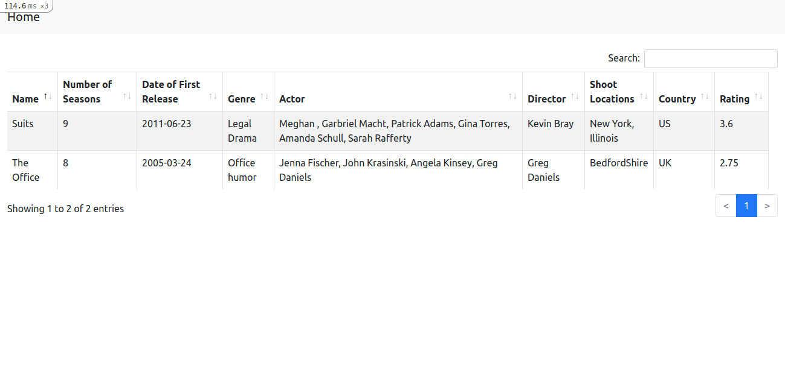
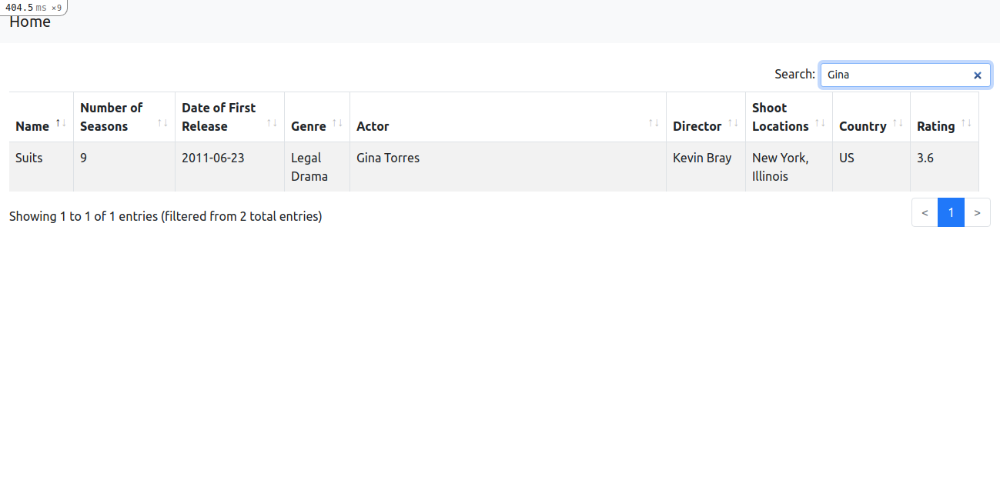

# TV Series Assignment

This is an assignent.

## Getting started

To get started with the app, first clone the repo and `cd` into the directory:

```
$ git clone https://github.com/awsmsid/tv_series_assignment.git
$ cd tv_series_assignment
```

Then use the ruby-3.0.1:

```
$ rvm use 3.0.1
```

Install the needed gems:

```
$ bundle install
```

Install JavaScript dependencies:

```
$ yarn install
```

Next, migrate and seed the database:

```
$ rails db:migrate db:seed
```

Finally, run the test suite to verify that everything is working correctly:

```
$ rspec
```

If the test suite passes, you'll be ready to run the app in a local server:

```
$ rails server
```

Tv series list page:



List page with search:
